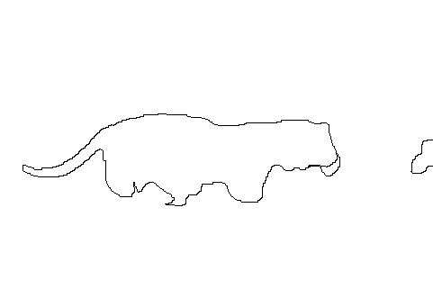
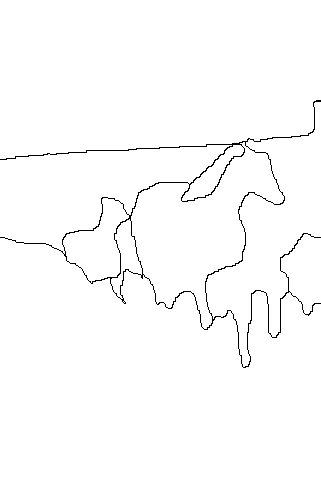
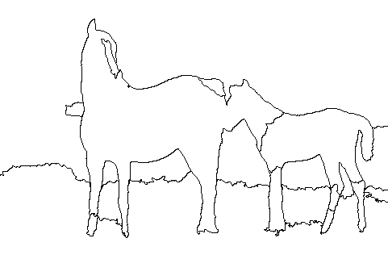
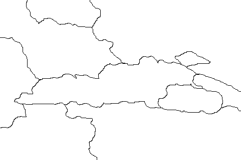
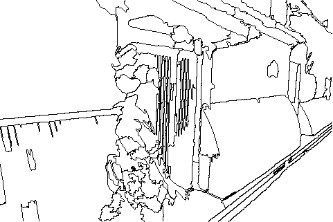
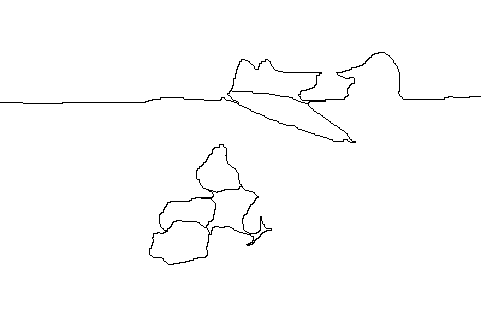

<article class = "post">

## Evaluation From 5

请判断以下分割结果是否正确划分出了图像中有意义的目标对象。

注意：判断时应该考虑分割结果包含的所有结构的分割质量。

每个问题中三幅图像从左至右分别为原图、图1、图2。

需要完成所有问题后提交。若提交出错，请使用浏览器后退功能返回表格页，重新填写并提交

* Required

<form action="https://docs.google.com/forms/d/1Aqx5TCpa7uOaZgObW2ua82bmwxQkBGIVzi-EgfG0UqM/formResponse" method="POST" id="ss-form" target="_self" onsubmit="">

### Name *

<input type="text" name="entry.410482311" value="" id="entry_410482311" dir="auto" aria-required="true" required="" title="">

### 1. Choose the better segmentation of the original image *

<table>
  <tr>
    <td></td>
    <td></td>
    <td></td>
  </tr>
  <tr>
    <td>Origin Image</td>
    <td>Segmentation 1 Result</td>
    <td>Segmentation 2 Result</td>
  </tr>
</table>

+ <input type="radio" name="entry.1409578657" value="1" id="group_1409578657_1" aria-label="1" required="">Segmentation 1
+ <input type="radio" name="entry.1409578657" value="2" id="group_1409578657_2" aria-label="2" required="">Segmentation 2

### 2. Choose the better segmentation of the original image *

<table>
  <tr>
    <td></td>
    <td></td>
    <td></td>
  </tr>
  <tr>
    <td>Origin Image</td>
    <td>Segmentation 1 Result</td>
    <td>Segmentation 2 Result</td>
  </tr>
</table>

+ <input type="radio" name="entry.1980276258" value="1" id="group_1980276258_1" aria-label="1" required="">Segmentation 1
+ <input type="radio" name="entry.1980276258" value="2" id="group_1980276258_2" aria-label="2" required="">Segmentation 2

### 3. Choose the better segmentation of the original image *

<table>
  <tr>
    <td></td>
    <td></td>
    <td></td>
  </tr>
  <tr>
    <td>Origin Image</td>
    <td>Segmentation 1 Result</td>
    <td>Segmentation 2 Result</td>
  </tr>
</table>

+ <input type="radio" name="entry.1810955519" value="1" id="group_1810955519_1" aria-label="1" required="">Segmentation 1
+ <input type="radio" name="entry.1810955519" value="2" id="group_1810955519_2" aria-label="2" required="">Segmentation 2

### 4. Choose the better segmentation of the original image *

<table>
  <tr>
    <td></td>
    <td></td>
    <td></td>
  </tr>
  <tr>
    <td>Origin Image</td>
    <td>Segmentation 1 Result</td>
    <td>Segmentation 2 Result</td>
  </tr>
</table>

+ <input type="radio" name="entry.701184789" value="1" id="group_701184789_1" aria-label="1" required="">Segmentation 1
+ <input type="radio" name="entry.701184789" value="2" id="group_701184789_2" aria-label="2" required="">Segmentation 2

### 5. Choose the better segmentation of the original image *

<table>
  <tr>
    <td></td>
    <td></td>
    <td></td>
  </tr>
  <tr>
    <td>Origin Image</td>
    <td>Segmentation 1 Result</td>
    <td>Segmentation 2 Result</td>
  </tr>
</table>

+ <input type="radio" name="entry.1804352564" value="1" id="group_1804352564_1" aria-label="1" required="">Segmentation 1
+ <input type="radio" name="entry.1804352564" value="2" id="group_1804352564_2" aria-label="2" required="">Segmentation 2

### 6. Choose the better segmentation of the original image *

<table>
  <tr>
    <td></td>
    <td></td>
    <td></td>
  </tr>
  <tr>
    <td>Origin Image</td>
    <td>Segmentation 1 Result</td>
    <td>Segmentation 2 Result</td>
  </tr>
</table>

+ <input type="radio" name="entry.481785825" value="1" id="group_481785825_1" aria-label="1" required="">Segmentation 1
+ <input type="radio" name="entry.481785825" value="2" id="group_481785825_2" aria-label="2" required="">Segmentation 2

### 7. Choose the better segmentation of the original image *

<table>
  <tr>
    <td></td>
    <td></td>
    <td></td>
  </tr>
  <tr>
    <td>Origin Image</td>
    <td>Segmentation 1 Result</td>
    <td>Segmentation 2 Result</td>
  </tr>
</table>

+ <input type="radio" name="entry.107720121" value="1" id="group_107720121_1" aria-label="1" required="">Segmentation 1
+ <input type="radio" name="entry.107720121" value="2" id="group_107720121_2" aria-label="2" required="">Segmentation 2

### 8. Choose the better segmentation of the original image *

<table>
  <tr>
    <td></td>
    <td></td>
    <td></td>
  </tr>
  <tr>
    <td>Origin Image</td>
    <td>Segmentation 1 Result</td>
    <td>Segmentation 2 Result</td>
  </tr>
</table>

+ <input type="radio" name="entry.54151110" value="1" id="group_54151110_1" aria-label="1" required="">Segmentation 1
+ <input type="radio" name="entry.54151110" value="2" id="group_54151110_2" aria-label="2" required="">Segmentation 2

### 9. Choose the better segmentation of the original image *

<table>
  <tr>
    <td></td>
    <td></td>
    <td></td>
  </tr>
  <tr>
    <td>Origin Image</td>
    <td>Segmentation 1 Result</td>
    <td>Segmentation 2 Result</td>
  </tr>
</table>

+ <input type="radio" name="entry.945343773" value="1" id="group_945343773_1" aria-label="1" required="">Segmentation 1
+ <input type="radio" name="entry.945343773" value="2" id="group_945343773_2" aria-label="2" required="">Segmentation 2

### 10. Choose the better segmentation of the original image *

<table>
  <tr>
    <td></td>
    <td></td>
    <td></td>
  </tr>
  <tr>
    <td>Origin Image</td>
    <td>Segmentation 1 Result</td>
    <td>Segmentation 2 Result</td>
  </tr>
</table>

+ <input type="radio" name="entry.507778668" value="1" id="group_507778668_1" aria-label="1" required="">Segmentation 1
+ <input type="radio" name="entry.507778668" value="2" id="group_507778668_2" aria-label="2" required="">Segmentation 2

### 11. Choose the better segmentation of the original image *

<table>
  <tr>
    <td></td>
    <td></td>
    <td></td>
  </tr>
  <tr>
    <td>Origin Image</td>
    <td>Segmentation 1 Result</td>
    <td>Segmentation 2 Result</td>
  </tr>
</table>

+ <input type="radio" name="entry.1310127274" value="1" id="group_1310127274_1" aria-label="1" required="">Segmentation 1
+ <input type="radio" name="entry.1310127274" value="2" id="group_1310127274_2" aria-label="2" required="">Segmentation 2

### 12. Choose the better segmentation of the original image *

<table>
  <tr>
    <td></td>
    <td></td>
    <td></td>
  </tr>
  <tr>
    <td>Origin Image</td>
    <td>Segmentation 1 Result</td>
    <td>Segmentation 2 Result</td>
  </tr>
</table>

+ <input type="radio" name="entry.539397572" value="1" id="group_539397572_1" aria-label="1" required="">Segmentation 1
+ <input type="radio" name="entry.539397572" value="2" id="group_539397572_2" aria-label="2" required="">Segmentation 2

### 13. Choose the better segmentation of the original image *

<table>
  <tr>
    <td></td>
    <td></td>
    <td></td>
  </tr>
  <tr>
    <td>Origin Image</td>
    <td>Segmentation 1 Result</td>
    <td>Segmentation 2 Result</td>
  </tr>
</table>

+ <input type="radio" name="entry.1784719043" value="1" id="group_1784719043_1" aria-label="1" required="">Segmentation 1
+ <input type="radio" name="entry.1784719043" value="2" id="group_1784719043_2" aria-label="2" required="">Segmentation 2

### 14. Choose the better segmentation of the original image *

<table>
  <tr>
    <td></td>
    <td></td>
    <td></td>
  </tr>
  <tr>
    <td>Origin Image</td>
    <td>Segmentation 1 Result</td>
    <td>Segmentation 2 Result</td>
  </tr>
</table>

+ <input type="radio" name="entry.566319273" value="1" id="group_566319273_1" aria-label="1" required="">Segmentation 1
+ <input type="radio" name="entry.566319273" value="2" id="group_566319273_2" aria-label="2" required="">Segmentation 2

### 15. Choose the better segmentation of the original image *

<table>
  <tr>
    <td></td>
    <td></td>
    <td></td>
  </tr>
  <tr>
    <td>Origin Image</td>
    <td>Segmentation 1 Result</td>
    <td>Segmentation 2 Result</td>
  </tr>
</table>

+ <input type="radio" name="entry.409025282" value="1" id="group_409025282_1" aria-label="1" required="">Segmentation 1
+ <input type="radio" name="entry.409025282" value="2" id="group_409025282_2" aria-label="2" required="">Segmentation 2

### 16. Choose the better segmentation of the original image *

<table>
  <tr>
    <td></td>
    <td></td>
    <td></td>
  </tr>
  <tr>
    <td>Origin Image</td>
    <td>Segmentation 1 Result</td>
    <td>Segmentation 2 Result</td>
  </tr>
</table>

+ <input type="radio" name="entry.1782692197" value="1" id="group_1782692197_1" aria-label="1" required="">Segmentation 1
+ <input type="radio" name="entry.1782692197" value="2" id="group_1782692197_2" aria-label="2" required="">Segmentation 2

### 17. Choose the better segmentation of the original image *

<table>
  <tr>
    <td></td>
    <td></td>
    <td></td>
  </tr>
  <tr>
    <td>Origin Image</td>
    <td>Segmentation 1 Result</td>
    <td>Segmentation 2 Result</td>
  </tr>
</table>

+ <input type="radio" name="entry.1647751419" value="1" id="group_1647751419_1" aria-label="1" required="">Segmentation 1
+ <input type="radio" name="entry.1647751419" value="2" id="group_1647751419_2" aria-label="2" required="">Segmentation 2

### 18. Choose the better segmentation of the original image *

<table>
  <tr>
    <td></td>
    <td></td>
    <td></td>
  </tr>
  <tr>
    <td>Origin Image</td>
    <td>Segmentation 1 Result</td>
    <td>Segmentation 2 Result</td>
  </tr>
</table>

+ <input type="radio" name="entry.1813552548" value="1" id="group_1813552548_1" aria-label="1" required="">Segmentation 1
+ <input type="radio" name="entry.1813552548" value="2" id="group_1813552548_2" aria-label="2" required="">Segmentation 2

### 19. Choose the better segmentation of the original image *

<table>
  <tr>
    <td></td>
    <td></td>
    <td></td>
  </tr>
  <tr>
    <td>Origin Image</td>
    <td>Segmentation 1 Result</td>
    <td>Segmentation 2 Result</td>
  </tr>
</table>

+ <input type="radio" name="entry.1286746205" value="1" id="group_1286746205_1" aria-label="1" required="">Segmentation 1
+ <input type="radio" name="entry.1286746205" value="2" id="group_1286746205_2" aria-label="2" required="">Segmentation 2

### 20. Choose the better segmentation of the original image *

<table>
  <tr>
    <td></td>
    <td></td>
    <td></td>
  </tr>
  <tr>
    <td>Origin Image</td>
    <td>Segmentation 1 Result</td>
    <td>Segmentation 2 Result</td>
  </tr>
</table>

+ <input type="radio" name="entry.1212192299" value="1" id="group_1212192299_1" aria-label="1" required="">Segmentation 1
+ <input type="radio" name="entry.1212192299" value="2" id="group_1212192299_2" aria-label="2" required="">Segmentation 2

### 21. Choose the better segmentation of the original image *

<table>
  <tr>
    <td></td>
    <td></td>
    <td></td>
  </tr>
  <tr>
    <td>Origin Image</td>
    <td>Segmentation 1 Result</td>
    <td>Segmentation 2 Result</td>
  </tr>
</table>

+ <input type="radio" name="entry.1057559133" value="1" id="group_1057559133_1" aria-label="1" required="">Segmentation 1
+ <input type="radio" name="entry.1057559133" value="2" id="group_1057559133_2" aria-label="2" required="">Segmentation 2

### 22. Choose the better segmentation of the original image *

<table>
  <tr>
    <td></td>
    <td></td>
    <td></td>
  </tr>
  <tr>
    <td>Origin Image</td>
    <td>Segmentation 1 Result</td>
    <td>Segmentation 2 Result</td>
  </tr>
</table>

+ <input type="radio" name="entry.1410175114" value="1" id="group_1410175114_1" aria-label="1" required="">Segmentation 1
+ <input type="radio" name="entry.1410175114" value="2" id="group_1410175114_2" aria-label="2" required="">Segmentation 2

### 23. Choose the better segmentation of the original image *

<table>
  <tr>
    <td></td>
    <td></td>
    <td></td>
  </tr>
  <tr>
    <td>Origin Image</td>
    <td>Segmentation 1 Result</td>
    <td>Segmentation 2 Result</td>
  </tr>
</table>

+ <input type="radio" name="entry.1703106703" value="1" id="group_1703106703_1" aria-label="1" required="">Segmentation 1
+ <input type="radio" name="entry.1703106703" value="2" id="group_1703106703_2" aria-label="2" required="">Segmentation 2

### 24. Choose the better segmentation of the original image *

<table>
  <tr>
    <td></td>
    <td></td>
    <td></td>
  </tr>
  <tr>
    <td>Origin Image</td>
    <td>Segmentation 1 Result</td>
    <td>Segmentation 2 Result</td>
  </tr>
</table>

+ <input type="radio" name="entry.1212637644" value="1" id="group_1212637644_1" aria-label="1" required="">Segmentation 1
+ <input type="radio" name="entry.1212637644" value="2" id="group_1212637644_2" aria-label="2" required="">Segmentation 2

### 25. Choose the better segmentation of the original image *

<table>
  <tr>
    <td></td>
    <td></td>
    <td></td>
  </tr>
  <tr>
    <td>Origin Image</td>
    <td>Segmentation 1 Result</td>
    <td>Segmentation 2 Result</td>
  </tr>
</table>

+ <input type="radio" name="entry.1448519527" value="1" id="group_1448519527_1" aria-label="1" required="">Segmentation 1
+ <input type="radio" name="entry.1448519527" value="2" id="group_1448519527_2" aria-label="2" required="">Segmentation 2

### 26. Choose the better segmentation of the original image *

<table>
  <tr>
    <td></td>
    <td></td>
    <td></td>
  </tr>
  <tr>
    <td>Origin Image</td>
    <td>Segmentation 1 Result</td>
    <td>Segmentation 2 Result</td>
  </tr>
</table>

+ <input type="radio" name="entry.234388849" value="1" id="group_234388849_1" aria-label="1" required="">Segmentation 1
+ <input type="radio" name="entry.234388849" value="2" id="group_234388849_2" aria-label="2" required="">Segmentation 2

### 27. Choose the better segmentation of the original image *

<table>
  <tr>
    <td></td>
    <td></td>
    <td></td>
  </tr>
  <tr>
    <td>Origin Image</td>
    <td>Segmentation 1 Result</td>
    <td>Segmentation 2 Result</td>
  </tr>
</table>

+ <input type="radio" name="entry.1615669999" value="1" id="group_1615669999_1" aria-label="1" required="">Segmentation 1
+ <input type="radio" name="entry.1615669999" value="2" id="group_1615669999_2" aria-label="2" required="">Segmentation 2

### 28. Choose the better segmentation of the original image *

<table>
  <tr>
    <td></td>
    <td></td>
    <td></td>
  </tr>
  <tr>
    <td>Origin Image</td>
    <td>Segmentation 1 Result</td>
    <td>Segmentation 2 Result</td>
  </tr>
</table>

+ <input type="radio" name="entry.160989829" value="1" id="group_160989829_1" aria-label="1" required="">Segmentation 1
+ <input type="radio" name="entry.160989829" value="2" id="group_160989829_2" aria-label="2" required="">Segmentation 2

### 29. Choose the better segmentation of the original image *

<table>
  <tr>
    <td></td>
    <td></td>
    <td></td>
  </tr>
  <tr>
    <td>Origin Image</td>
    <td>Segmentation 1 Result</td>
    <td>Segmentation 2 Result</td>
  </tr>
</table>

+ <input type="radio" name="entry.1021893001" value="1" id="group_1021893001_1" aria-label="1" required="">Segmentation 1
+ <input type="radio" name="entry.1021893001" value="2" id="group_1021893001_2" aria-label="2" required="">Segmentation 2

### 30. Choose the better segmentation of the original image *

<table>
  <tr>
    <td></td>
    <td></td>
    <td></td>
  </tr>
  <tr>
    <td>Origin Image</td>
    <td>Segmentation 1 Result</td>
    <td>Segmentation 2 Result</td>
  </tr>
</table>

+ <input type="radio" name="entry.781300071" value="1" id="group_781300071_1" aria-label="1" required="">Segmentation 1
+ <input type="radio" name="entry.781300071" value="2" id="group_781300071_2" aria-label="2" required="">Segmentation 2

### 31. Choose the better segmentation of the original image *

<table>
  <tr>
    <td></td>
    <td></td>
    <td></td>
  </tr>
  <tr>
    <td>Origin Image</td>
    <td>Segmentation 1 Result</td>
    <td>Segmentation 2 Result</td>
  </tr>
</table>

+ <input type="radio" name="entry.756291474" value="1" id="group_756291474_1" aria-label="1" required="">Segmentation 1
+ <input type="radio" name="entry.756291474" value="2" id="group_756291474_2" aria-label="2" required="">Segmentation 2

### 32. Choose the better segmentation of the original image *

<table>
  <tr>
    <td></td>
    <td></td>
    <td></td>
  </tr>
  <tr>
    <td>Origin Image</td>
    <td>Segmentation 1 Result</td>
    <td>Segmentation 2 Result</td>
  </tr>
</table>

+ <input type="radio" name="entry.1670529643" value="1" id="group_1670529643_1" aria-label="1" required="">Segmentation 1
+ <input type="radio" name="entry.1670529643" value="2" id="group_1670529643_2" aria-label="2" required="">Segmentation 2

### 33. Choose the better segmentation of the original image *

<table>
  <tr>
    <td></td>
    <td></td>
    <td></td>
  </tr>
  <tr>
    <td>Origin Image</td>
    <td>Segmentation 1 Result</td>
    <td>Segmentation 2 Result</td>
  </tr>
</table>

+ <input type="radio" name="entry.1097809813" value="1" id="group_1097809813_1" aria-label="1" required="">Segmentation 1
+ <input type="radio" name="entry.1097809813" value="2" id="group_1097809813_2" aria-label="2" required="">Segmentation 2

### 34. Choose the better segmentation of the original image *

<table>
  <tr>
    <td></td>
    <td></td>
    <td></td>
  </tr>
  <tr>
    <td>Origin Image</td>
    <td>Segmentation 1 Result</td>
    <td>Segmentation 2 Result</td>
  </tr>
</table>

+ <input type="radio" name="entry.1147189478" value="1" id="group_1147189478_1" aria-label="1" required="">Segmentation 1
+ <input type="radio" name="entry.1147189478" value="2" id="group_1147189478_2" aria-label="2" required="">Segmentation 2

### 35. Choose the better segmentation of the original image *

<table>
  <tr>
    <td></td>
    <td></td>
    <td></td>
  </tr>
  <tr>
    <td>Origin Image</td>
    <td>Segmentation 1 Result</td>
    <td>Segmentation 2 Result</td>
  </tr>
</table>

+ <input type="radio" name="entry.1569983762" value="1" id="group_1569983762_1" aria-label="1" required="">Segmentation 1
+ <input type="radio" name="entry.1569983762" value="2" id="group_1569983762_2" aria-label="2" required="">Segmentation 2

### 36. Choose the better segmentation of the original image *

<table>
  <tr>
    <td></td>
    <td></td>
    <td></td>
  </tr>
  <tr>
    <td>Origin Image</td>
    <td>Segmentation 1 Result</td>
    <td>Segmentation 2 Result</td>
  </tr>
</table>

+ <input type="radio" name="entry.772833641" value="1" id="group_772833641_1" aria-label="1" required="">Segmentation 1
+ <input type="radio" name="entry.772833641" value="2" id="group_772833641_2" aria-label="2" required="">Segmentation 2

### 37. Choose the better segmentation of the original image *

<table>
  <tr>
    <td></td>
    <td></td>
    <td></td>
  </tr>
  <tr>
    <td>Origin Image</td>
    <td>Segmentation 1 Result</td>
    <td>Segmentation 2 Result</td>
  </tr>
</table>

+ <input type="radio" name="entry.1741804816" value="1" id="group_1741804816_1" aria-label="1" required="">Segmentation 1
+ <input type="radio" name="entry.1741804816" value="2" id="group_1741804816_2" aria-label="2" required="">Segmentation 2

### 38. Choose the better segmentation of the original image *

<table>
  <tr>
    <td></td>
    <td></td>
    <td></td>
  </tr>
  <tr>
    <td>Origin Image</td>
    <td>Segmentation 1 Result</td>
    <td>Segmentation 2 Result</td>
  </tr>
</table>

+ <input type="radio" name="entry.1992447901" value="1" id="group_1992447901_1" aria-label="1" required="">Segmentation 1
+ <input type="radio" name="entry.1992447901" value="2" id="group_1992447901_2" aria-label="2" required="">Segmentation 2

### 39. Choose the better segmentation of the original image *

<table>
  <tr>
    <td></td>
    <td></td>
    <td></td>
  </tr>
  <tr>
    <td>Origin Image</td>
    <td>Segmentation 1 Result</td>
    <td>Segmentation 2 Result</td>
  </tr>
</table>

+ <input type="radio" name="entry.1397202463" value="1" id="group_1397202463_1" aria-label="1" required="">Segmentation 1
+ <input type="radio" name="entry.1397202463" value="2" id="group_1397202463_2" aria-label="2" required="">Segmentation 2

### 40. Choose the better segmentation of the original image *

<table>
  <tr>
    <td></td>
    <td></td>
    <td></td>
  </tr>
  <tr>
    <td>Origin Image</td>
    <td>Segmentation 1 Result</td>
    <td>Segmentation 2 Result</td>
  </tr>
</table>

+ <input type="radio" name="entry.386108779" value="1" id="group_386108779_1" aria-label="1" required="">Segmentation 1
+ <input type="radio" name="entry.386108779" value="2" id="group_386108779_2" aria-label="2" required="">Segmentation 2

### 41. Choose the better segmentation of the original image *

<table>
  <tr>
    <td></td>
    <td></td>
    <td></td>
  </tr>
  <tr>
    <td>Origin Image</td>
    <td>Segmentation 1 Result</td>
    <td>Segmentation 2 Result</td>
  </tr>
</table>

+ <input type="radio" name="entry.987606059" value="1" id="group_987606059_1" aria-label="1" required="">Segmentation 1
+ <input type="radio" name="entry.987606059" value="2" id="group_987606059_2" aria-label="2" required="">Segmentation 2

### 42. Choose the better segmentation of the original image *

<table>
  <tr>
    <td></td>
    <td></td>
    <td></td>
  </tr>
  <tr>
    <td>Origin Image</td>
    <td>Segmentation 1 Result</td>
    <td>Segmentation 2 Result</td>
  </tr>
</table>

+ <input type="radio" name="entry.960392208" value="1" id="group_960392208_1" aria-label="1" required="">Segmentation 1
+ <input type="radio" name="entry.960392208" value="2" id="group_960392208_2" aria-label="2" required="">Segmentation 2

### 43. Choose the better segmentation of the original image *

<table>
  <tr>
    <td></td>
    <td></td>
    <td></td>
  </tr>
  <tr>
    <td>Origin Image</td>
    <td>Segmentation 1 Result</td>
    <td>Segmentation 2 Result</td>
  </tr>
</table>

+ <input type="radio" name="entry.1316484524" value="1" id="group_1316484524_1" aria-label="1" required="">Segmentation 1
+ <input type="radio" name="entry.1316484524" value="2" id="group_1316484524_2" aria-label="2" required="">Segmentation 2

### 44. Choose the better segmentation of the original image *

<table>
  <tr>
    <td></td>
    <td></td>
    <td></td>
  </tr>
  <tr>
    <td>Origin Image</td>
    <td>Segmentation 1 Result</td>
    <td>Segmentation 2 Result</td>
  </tr>
</table>

+ <input type="radio" name="entry.298880713" value="1" id="group_298880713_1" aria-label="1" required="">Segmentation 1
+ <input type="radio" name="entry.298880713" value="2" id="group_298880713_2" aria-label="2" required="">Segmentation 2

### 45. Choose the better segmentation of the original image *

<table>
  <tr>
    <td></td>
    <td></td>
    <td></td>
  </tr>
  <tr>
    <td>Origin Image</td>
    <td>Segmentation 1 Result</td>
    <td>Segmentation 2 Result</td>
  </tr>
</table>

+ <input type="radio" name="entry.1767050880" value="1" id="group_1767050880_1" aria-label="1" required="">Segmentation 1
+ <input type="radio" name="entry.1767050880" value="2" id="group_1767050880_2" aria-label="2" required="">Segmentation 2

### 46. Choose the better segmentation of the original image *

<table>
  <tr>
    <td></td>
    <td></td>
    <td></td>
  </tr>
  <tr>
    <td>Origin Image</td>
    <td>Segmentation 1 Result</td>
    <td>Segmentation 2 Result</td>
  </tr>
</table>

+ <input type="radio" name="entry.1344614186" value="1" id="group_1344614186_1" aria-label="1" required="">Segmentation 1
+ <input type="radio" name="entry.1344614186" value="2" id="group_1344614186_2" aria-label="2" required="">Segmentation 2

### 47. Choose the better segmentation of the original image *

<table>
  <tr>
    <td></td>
    <td></td>
    <td></td>
  </tr>
  <tr>
    <td>Origin Image</td>
    <td>Segmentation 1 Result</td>
    <td>Segmentation 2 Result</td>
  </tr>
</table>

+ <input type="radio" name="entry.1115628364" value="1" id="group_1115628364_1" aria-label="1" required="">Segmentation 1
+ <input type="radio" name="entry.1115628364" value="2" id="group_1115628364_2" aria-label="2" required="">Segmentation 2

### 48. Choose the better segmentation of the original image *

<table>
  <tr>
    <td></td>
    <td></td>
    <td></td>
  </tr>
  <tr>
    <td>Origin Image</td>
    <td>Segmentation 1 Result</td>
    <td>Segmentation 2 Result</td>
  </tr>
</table>

+ <input type="radio" name="entry.1569495551" value="1" id="group_1569495551_1" aria-label="1" required="">Segmentation 1
+ <input type="radio" name="entry.1569495551" value="2" id="group_1569495551_2" aria-label="2" required="">Segmentation 2

### 49. Choose the better segmentation of the original image *

<table>
  <tr>
    <td></td>
    <td></td>
    <td></td>
  </tr>
  <tr>
    <td>Origin Image</td>
    <td>Segmentation 1 Result</td>
    <td>Segmentation 2 Result</td>
  </tr>
</table>

+ <input type="radio" name="entry.1801592293" value="1" id="group_1801592293_1" aria-label="1" required="">Segmentation 1
+ <input type="radio" name="entry.1801592293" value="2" id="group_1801592293_2" aria-label="2" required="">Segmentation 2

### 50. Choose the better segmentation of the original image *

<table>
  <tr>
    <td></td>
    <td></td>
    <td></td>
  </tr>
  <tr>
    <td>Origin Image</td>
    <td>Segmentation 1 Result</td>
    <td>Segmentation 2 Result</td>
  </tr>
</table>

+ <input type="radio" name="entry.2124773332" value="1" id="group_2124773332_1" aria-label="1" required="">Segmentation 1
+ <input type="radio" name="entry.2124773332" value="2" id="group_2124773332_2" aria-label="2" required="">Segmentation 2

## <input type="submit" name="submit" value="Submit" id="ss-submit">
