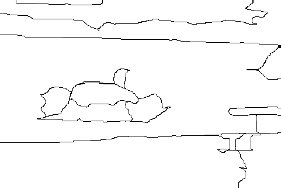
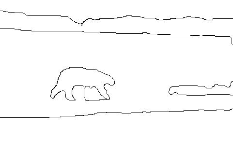

<article class = "post">

# EvaT1

Evaluation form test 1

<b>*</b> Required

<form action="https://docs.google.com/forms/d/19zSp-B-fQcsBEwF0fQ3x1ba88OVDSw6O6ZIHVHOMqC0/formResponse" method="POST" id="ss-form" target="_self" onsubmit="">

<ol style="padding-left: 0">

<label for="entry_383648049">Name
<label for="itemView.getDomIdToLabel()" aria-label="(Required field)"></label>
*
</label>

<input type="text" name="entry.383648049" value="" id="entry_383648049" dir="auto" aria-required="true" required="" title="">

<label for="entry_1428396990">
  1. the only question
  <label for="itemView.getDomIdToLabel()" aria-label="(Required field)">
  </label>
  *
  choose an answer
</label>

<table>
  <tr>
    <td></td>
    <td></td>
    <td></td>
  </tr>
  <tr>
    <td>Origin Image</td>
    <td>Segmentation 1 Result</td>
    <td>Segmentation 2 Result</td>
  </tr>
</table>

<ul>
  <li>
    <label>
      <input type="radio" name="entry.1928622168" value="Option 1" id="group_1928622168_1" aria-label="Option 1" required="">
        Segmentation 1
    </label>
  </li> 
  <li>
    <label>
      <input type="radio" name="entry.1928622168" value="Option 2" id="group_1928622168_2" aria-label="Option 2" required="">
      Segmentation 2
    </label>
  </li>
</ul>

<input type="hidden" name="draftResponse" value="[]">
<input type="hidden" name="pageHistory" value="0">

<input type="submit" name="submit" value="Submit" id="ss-submit">

</ol>
</form>

